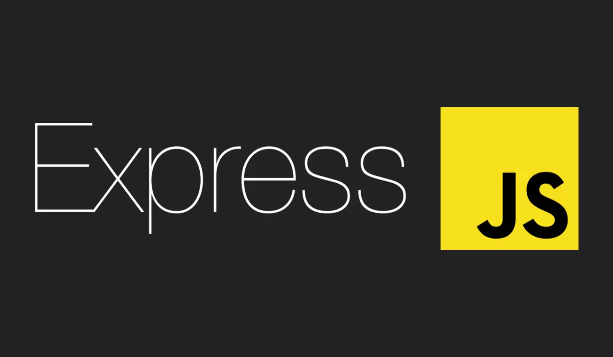

<h1 align="center">Node.js Express.js Template</h1>

<p align="center">
    <a href="https://expressjs.com/" target="blank"></a>
  </p>

This is a boilerplate template for building a Node.js application using the Express.js framework. It includes configurations for common middleware, routing, and error handling and is ready to be used as a starting point for your own projects.

---

## Features

- **Cluster**: Spawns multiple processes of the app to take advantage of multi-core systems.
- **Compression**: Response compression to improve performance.
- **Cookie Parser**: Parses HTTP request cookies.
- **Cookie Session**: Secure cookie-based session handling.
- **CORS**: Cross-Origin Resource Sharing setup.
- **Environment Variables**: Loads environment variables from a `.env` file.
- **Express.js**: Minimalist web framework for Node.js.
- **Helmet**: Enhances app security with HTTP headers.
- **HTTP Request Logger**: Logs HTTP requests with Morgan.
- **Joi**: Schema validation for JSON data.
- **JSON Web Tokens**: Generates and verifies JSON Web Tokens.
- **Passport**: Authentication middleware for Node.js.
- **Pino**: Fast and lightweight logger for Node.js.
- **Static Files**: Serves files from the `public` directory.
- **Error Handling**: Centralized error-handling mechanism.

---

## Installation

### 1. Clone the repository:
   ```bash
   git clone https://github.com/your-repo/node-express-template.git
   ```

### 2. Navigate to the project directory:
   ```bash
   cd node-express-template
   ```

### 3. Install dependencies:
   ```bash
   npm install
   ```

### 4. Start the development server:
   ```bash
   npm run dev
   ```

### 5. Start the production server:
   ```bash
   npm start
   ```
---
